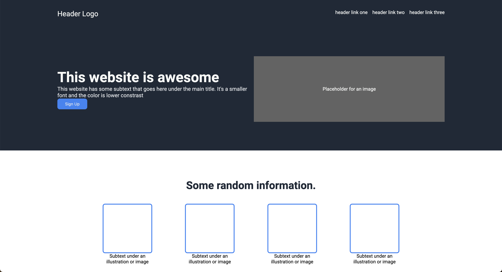
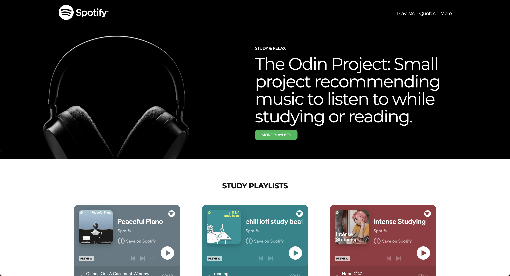

# Project-Landing-Page
The Odin Project - Landing Page Project

**Note:** Project does not include a responsive design.

## Assignment

- **Download Design Images:** 
  - [Image One (Full Design)](link-to-image-one)
  - [Image Two (Color and Fonts)](link-to-image-two)
- **Key Points:**
  - Use Roboto font.
  - Hero text is the statement at the top of the page.
- **Approach:**
  - Take it one section at a time.
  - Focus on HTML first, then CSS.
  - Utilize only one stylesheet.
  - Reference flexbox exercises if needed.
  - Mobile responsiveness is not required.
- **Commit Early & Often:**
  - Reference the Commit Message lesson for guidance.
- **Push to GitHub:**
  - Don’t forget to push your completed project to GitHub!

## Instructions

1. Review the provided design images.
2. Create HTML and CSS files to build the web page.
3. Replicate the design as closely as possible.
4. Substitute placeholder content with your own images and text.
5. Feel free to customize colors, fonts, and other design elements to personalize the page.

## Original Version

The image above shows the original version of the Landing Page Project that fulfills all the requirements for the assigment, without any extras added.

## Final Version

The image above shows the final version of the Landing Page Project which has been modified to use actual images instead of placeholder, has a theme (a Spotify Playlist recomendation website).
